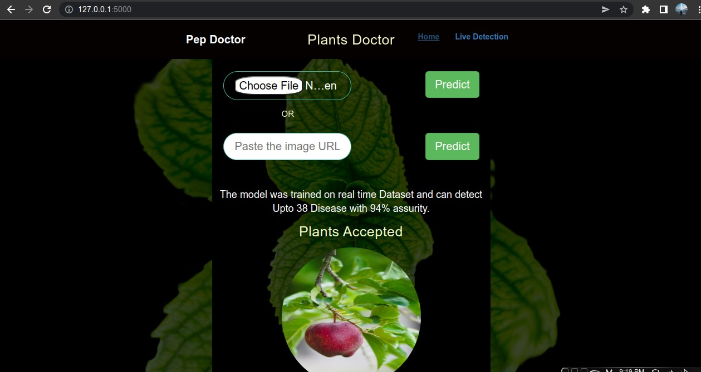
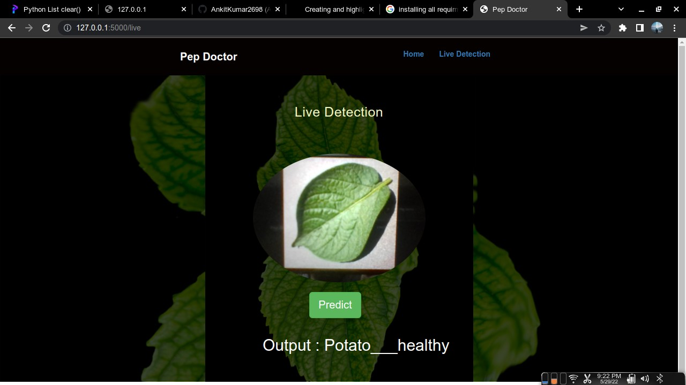

# Plant Disease Detection 


##  Running on Local Host :
*  Clone the repository on local host
*  Run command  ```pip install -r requirements.txt ```
*  If get any error from above command use ```pip3 install -r requirements.txt ```
* Run the application
    *   Window users :  ```python app.py```
    *   Linux users : ```python3 app.py```

## Intro to Website :
* Home Page :
    * Page Contatins file Upload:
        * Upload the picture of leaf and get the disease detected
    * Page also contatin link option for online pictures
   
*   Live Detection :
    * Page detect the live images
     
##  Model Specs : 
* Trained on 17572 images 
* can predict 38 Disease
* Xception net with imagenet used
* 92 % model Accuracy on below categories

## Classes Model can Predict
* Apple___Apple_scab
* Apple___Black_rot
* Apple___Cedar_apple_rust
* Apple___healthy
* Blueberry___healthy
* Cherry_(including_sour)___healthy
* Cherry_(including_sour)___Powdery_mildew
* Corn_(maize)___Cercospora_leaf_spot Gray_leaf_spot
* Corn_(maize)___Common_rust_
* Corn_(maize)___healthy
* Corn_(maize)___Northern_Leaf_Blight
* Grape___Black_rot
* Grape___Esca_(Black_Measles)
* Grape___healthy
* Grape___Leaf_blight_(Isariopsis_Leaf_Spot)
* Orange___Haunglongbing_(Citrus_greening)
* Peach___Bacterial_spot
* Peach___healthy
* Pepper,_bell___Bacterial_spot
* Pepper,_bell___healthy
* Potato___Early_blight
* Potato___healthy
* Potato___Late_blight
* Raspberry___healthy
* Soybean___healthy
* Squash___Powdery_mildew
* Strawberry___healthy
* Strawberry___Leaf_scorch
* Tomato___Bacterial_spot
* Tomato___Early_blight
* Tomato___healthy
* Tomato___Late_blight
* Tomato___Leaf_Mold
* Tomato___Septoria_leaf_spot
* Tomato___Spider_mites 
* Two-spotted_spider_mite
* Tomato___Target_Spot
* Tomato___Tomato_mosaic_virus
* Tomato___Tomato_Yellow_Leaf_Curl_Virus


# How to Use:
 
Soon Website will be Deployed 

## What will be in the website
* Home Page Containing Picture Uploading option and test by Link.
* Fast Prediction
* Cure Suggestions
* Information about Disease 

## How it is going to help :
<hr>
As we know many farmers crops got destroyed due to disease in crops. I have my own story when there is a bacterial disease came in cotton plants. That turns every farmer of my village into hell of debt.

## So In many ways this project is going to help each and every farmer.
<hr>

# Future:
In future we are going to  :
* Train model on every plant disease
* Providing Cure on the website
* Providing Every possible help


<hr>

# <a href="https://drive.google.com/drive/folders/1G9HAd6CBBsVKw0_iKRP0EFaSZjowd_j4?usp=sharing">Drive  Model Link</a>